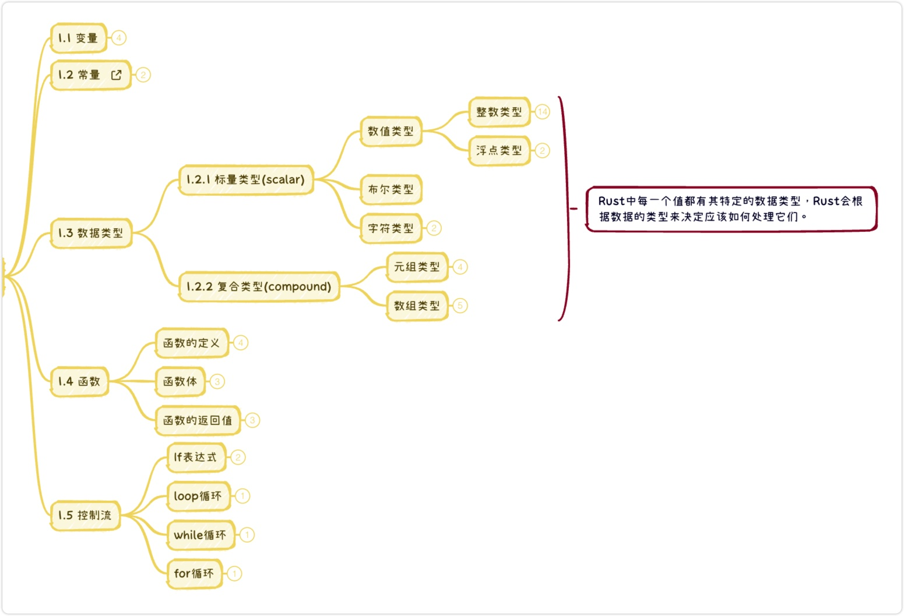

# Study rust repo

## Part 1: Basic concept

[code example](https://github.com/muziyan/rust-study/blob/feature/v1.%E9%80%9A%E7%94%A8%E6%A6%82%E5%BF%B5/src/main.rs)

Have the following content:
* [Variable](https://github.com/muziyan/rust-study/blob/feature/v1.%E9%80%9A%E7%94%A8%E6%A6%82%E5%BF%B5/src/main.rs#L3) 
* [DataType](https://github.com/muziyan/rust-study/blob/feature/v1.%E9%80%9A%E7%94%A8%E6%A6%82%E5%BF%B5/src/main.rs#L31)
* [Function define](https://github.com/muziyan/rust-study/blob/feature/v1.%E9%80%9A%E7%94%A8%E6%A6%82%E5%BF%B5/src/main.rs#L49)
* [Control flow](https://github.com/muziyan/rust-study/blob/feature/v1.%E9%80%9A%E7%94%A8%E6%A6%82%E5%BF%B5/src/main.rs#L67)
